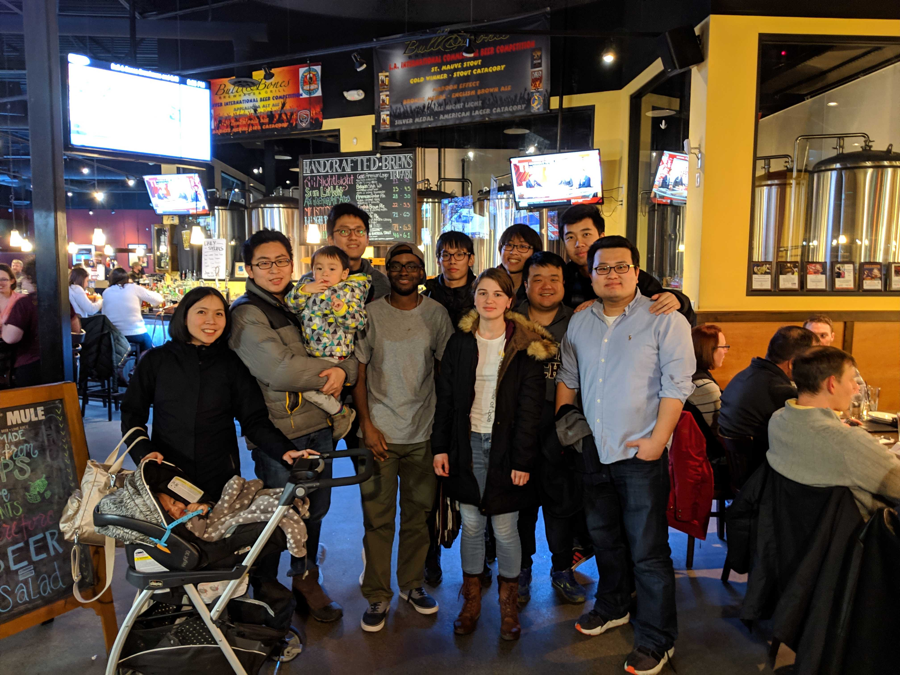

# Virginia Tech Vision and Learning Reading Group

Time
- Reading Group: Thursday 2PM - 3PM, Whittmore Hall 654
- Study Group: Friday 2PM - 3PM, Whittmore Hall 457B

## Table of Contents

- [Current Schedule (Spring 2019)](#current-schedule)
- [Previous Meetings](#previous-meetings)
- [Mailing List](#mailing-list)
- [Presenter](#presenter)
- [Related Links](#related-links)
- [FAQ](#faq)
- [About Us](#about-us)
- [Suggested Papers](#suggested-papers)

## Current Schedule

### Reading Group: Thursday 2PM - 3PM, Whittmore Hall 654

| Date       | Presenter     |  Topic     |
|-------------|--------|--------|
| 09/05 | Joseph Messou  | TBD |
| 09/12 | Jinwoo Choi    | TBD |
| 09/19 | Yuliang Zou    | TBD |
| 09/26 | Esther Robb    | TBD |
| 10/03 | Chen Gao       | TBD |
| 10/10 | Shih-Yang Su   | TBD |
| 10/17 | Xiaolong Li    | TBD |
| 10/24 | Si Chen        | TBD |
| 10/31 | Badour AlBahar | TBD |
| 11/07 | -              | No meeting - CVPR2020 deadline |
| 11/14 | -              | No meeting - CVPR2020 deadline |
| 11/21 | Jiarui Xu      | TBD |
| 11/28 | -              | No meeting - Happy Thanksgiving! |
| 12/05 | TBD            | TBD |

### Study Group: Friday 2PM - 3PM, Whittmore Hall 457B

| Date       | Instructor     |  Topic     |
|-------------|--------|--------|
| 09/06 | Yann LeCun  | [Deep Learning, Convolutional Neural Networks, and Self-Supervised Learning](https://www.youtube.com/watch?v=SGSOCuByo24&feature=youtu.be&app=desktop) |
| 09/13 | TBD  | TBD |
| 09/20 | TBD  | TBD |
| 09/27 | TBD  | TBD |
| 10/04 | TBD  | TBD |
| 10/11 | TBD  | TBD |
| 10/18 | TBD  | TBD |
| 10/25 | TBD  | TBD |
| 11/01 | TBD  | TBD |
| 11/08 | -    | No meeting - CVPR2020 deadline |
| 11/15 | -    | No meeting - CVPR2020 deadline |
| 11/22 | TBD  | TBD |
| 11/29 | -    | No meeting - Happy Thanksgiving! |
| 12/06 | TBD  | TBD |

## Previous Meetings
- [Fall 2017](https://github.com/vt-vl-lab/reading_group/blob/master/previous/2017_fall.md)
- [Spring 2018](https://github.com/vt-vl-lab/reading_group/blob/master/previous/2018_spring.md)
- [Fall 2018](https://github.com/vt-vl-lab/reading_group/blob/master/previous/2018_fall.md)
- [Spring 2019](https://github.com/vt-vl-lab/reading_group/blob/master/previous/2019_spring.md)

## Mailing List

We use Google Groups to manage the mailing list: [(link)](https://groups.google.com/a/vt.edu/forum/#!forum/vt-vision-and-learning-reading-group-g). You can click "Join Group" when you sign in with your Virginia Tech account.

## Presenter
- [Badour AlBahar](https://sites.google.com/vt.edu/badouralbahar/home)
- Si Chen
- [Jinwoo Choi](https://sites.google.com/site/jchoivision/)
- [Chen Gao](https://gaochen315.github.io/)
- [Xiaolong Li](https://dragonlong.github.io/)
- [Joseph Messou](https://josephcmessou.weebly.com/about.html)
- Esther Robb
- [Shih-Yang Su](https://lemonatsu.github.io/home)
- Jiarui Xu
- [Yuliang Zou](https://yuliang-zou.github.io/index.html)

Please contact [Jinwoo](https://sites.google.com/site/jchoivision/) if you want to be a presenter this semester!

## Related Links

#### Resources
- [Awesome Computer Vision](https://github.com/jbhuang0604/awesome-computer-vision)
- [Awesome Deep Vision](https://github.com/kjw0612/awesome-deep-vision)
- [Computer Vision Foundation open access](http://openaccess.thecvf.com/menu.py)

#### Similar reading group/seminars in other universities
- [MIT Vision Seminars](https://sites.google.com/view/visionseminar)
- [UIUC Vision Lunch](http://vision.cs.illinois.edu/vision_website/)
- [UT-Austin CV Reading Group](http://vision.cs.utexas.edu/readinggroup/)
- [CMU VASC Seminar Series](http://ri.cmu.edu/events/category/vasc-seminar-series/list/?tribe_paged=1&tribe_event_display=past)
- [CMU ML Reading Group](http://www.cs.cmu.edu/~aarti/SMLRG/schedule.html)

#### Advanced CV courses 
- [Advanced Computer Vision](https://filebox.ece.vt.edu/~jbhuang/teaching/ece6554/sp17/index.html) (Jia-Bin Huang, Virginia Tech)
- [Object and Activity Recognition Seminar](https://sites.google.com/site/ucbcs29443/) (Trevor Darrell, UC Berkeley)
- [Visual Learning and Recognition](http://graphics.cs.cmu.edu/courses/16-824/2017_spring/) (Abhinav Gupta, CMU)
- [Visual Recognition](http://vision.cs.utexas.edu/381V-fall2016/) (Kristen Grauman, UT Austin)
- [Advanced Computer Vision](https://filebox.ece.vt.edu/~S16ECE6554/) (Devi Parikh, Georgia Tech)
- [Cutting-Edge Trends in Deep Learning and Recognition](http://slazebni.cs.illinois.edu/spring17) (Svetlana Lazebnik, UIUC)

## FAQ
#### How is the presenters' order generated?
The presenters' order is generated from the presenters' list in a FIFO manner (but the list is initially generated randomly).

#### Who is responsible if I can not present at the scheduled time?
Yourself.

#### What should I do if I can not present at the scheduled time?
As early as possible, let the group organizer (ylzou -at- vt.edu) know about your situation. Also contact other presenters to see if they are willing to swap dates with you.

#### I have a question not listed here...
Then ask by sending an e-mail to the mailing list (vt-vision-and-learning-reading-group-g -at- vt.edu).

## About Us

#### How it works?
We are a group that meets about once a week to discuss one to three relevant papers. For every meeting, one person will be in charge of selecting the paper(s) for that meeting, thoroughly understanding the work, and leading the discussion (either informally or via a presentation, whatever the leader thinks is best). The rest of the members will read over the paper(s) beforehand to gain a basic idea of the work. Then, on the day of the meeting, we will discuss the strengths, weaknesses, and techniques of the paper(s).

**NOTE:** Please tell the group organizer (chengao -at- vt.edu) which paper(s) you are going to present, and summarize the paper/talk in several sentences, before Monday of that week.

#### What we read?
We will be reading papers appearing in the leading computer vision conferences (e.g., CVPR, ICCV, ECCV, SIGGRAPH, SIGGRAPH Asia) and machine learning conferences (e.g., NIPS, ICML, ICLR, UAI, AAAI, IJCAI, AISTATS). Members are free to choose which paper(s) they will present (we can also provide suggestions), thus the specific topics will vary based on the members' interests.

#### Who can join?
We are open to everyone who is interested, whether you are an undergrad, a grad student, or VT staff, regardless of department. Anyone else in the Blacksburg area is also welcome. As long as you are interested in learning more about the fields (by reading cutting-edge research papers), you are welcome to join.

## Suggested Papers

We maintain a pool of suggested papers [here](https://docs.google.com/spreadsheets/d/1XgWCct-Ppwdl764CLASi0MmlpNb8dqhdDUND4qOczqk/edit#gid=0).

Credits: The contents and formats were modified from [VT CVMLP Reading Group](https://filebox.ece.vt.edu/~cvmlreadinggroup/index.html).
